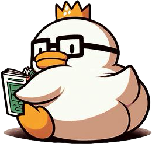

  <h1>Who's Ducking</h1>
  <h3>✨일본 애니메이션을 좋아하는 사람들을 위한 웹 커뮤니티 사이트✨</h3>
  

---

### ✅ Duration : 2024-06-03 ~ 2024-07-05

### ✅ Front-end
- HTML
- CSS
- JavaScript

### ✅ Back-end
- Java
- Spring MVC
- Thymeleaf
- Spring Data JPA
- MySQL
- Spring Security

### ✅ Development Environment
- IDE : IntelliJ IDEA Ultimate, Visual Studio Code
- Build : Gradle
- WAS : Tomcat

### ✅ Team Introduction

### **[정성진](https://github.com/jngsngjn)**
- 역할: 팀장, 버전 관리, Back-end 총괄
- 소개: 젤다의 전설과 하스스톤, 그리고 GLOCK 19를 좋아합니다.

### **[노승빈](https://github.com/SeungBeenNoh)**
- 역할: Front-end 총괄
- 소개: "class 이름은 항상 길게.."

### **[김수정](https://github.com/Kimsu10)**
- 역할: Back-end + Front-end 보조
- 소개: 반복이 싫은 개발자입니다.

### **[김승민](https://github.com/Booreung)**
- 역할: Back-end + Front-end 보조
- 소개: "우리가 안 한 게 뭐가 있지? ... 맞담? 맞아 종답!"

### **[서준명](https://github.com/astroboy5)**
- 역할: Front-end
- 소개: 축구 없이는 못 사는 남자

### **[안성민](https://github.com/Anseongmin5739)**
- 역할: Front-end
- 소개: 어디 출신? 비트캠프 프론트는? 승빈이형~